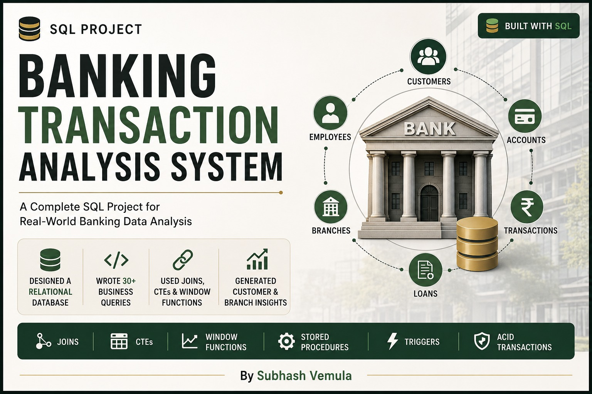

# Banking Transaction Analysis System

# Banking-Transaction-Analysis-System
A SQL-based Banking Transaction Analysis System featuring database design, triggers, stored procedures, CTEs, window functions, and business analytics queries.
# Banking Transaction Analysis System

## Overview
This project simulates a banking database system using SQL.

The system manages:
- Customers
- Accounts
- Transactions
- Loans

## Features
- Relational Database Design
- Triggers
- Stored Procedures
- CTEs
- Window Functions
- Business Analytics Queries

## Technologies Used
- MySQL
- SQL
- GitHub

## Project Status
In Progress 🚀

## Database Schema

## Project Structure

- SQL Scripts
  - Schema.sql
  - Sample_Data.sql
  - Triggers.sql
  - Stored_Procedures.sql
  - Business_Queries.sql

## Features

- Customer Management
- Account Management
- Transaction Tracking
- Loan Processing
- Fund Transfers
- Risk Analysis

## SQL Concepts Used

- Joins
- Aggregate Functions
- Group By
- HAVING
- Subqueries
- CTEs
- Window Functions
- Triggers
- Stored Procedures
- Transactions (ACID)

- ## Database Schema

